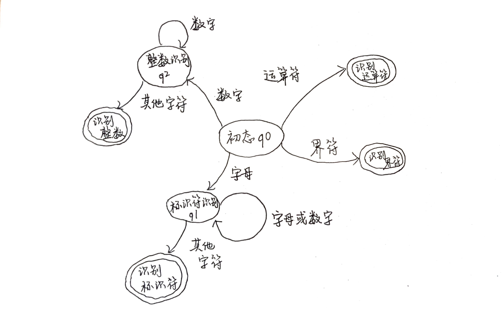

## <center>编译系统设计综合训练实验报告

### <center>第一次

## <center>词法分析程序设计与实现

### 一、实验目的

实现一个类Pascal源程序的词法分析程序，实现输入代码、输出词法分析二元式序列。

### 二、实验内容

1）	处理的语言：类似于PASCAL源程序。

2）	输出结果：二元式序列。

3）	该语言的单词符号包括：

- 保留字（10种）：
program  begin  end  var  integer  if  then  else  do  while

- 标识符

- 整型常数

- 界符、运算符（11种）：

   ＋  －  （  ）  =  >  <

  ;（分号，语句结束时使用）

  ,（定义变量时分隔多个变量）

  :（冒号，定义变量时使用）

  :=（冒号+等号，赋值号）

4）	输入方式：文本文件（如：.txt）。

5）	输出方式：文本文件（如：.txt）。每个单词表示成二元组（单词种别，属性值）。


### 三、实验分析

在编写代码之前，需要进行词法形式化描述、单词种别定义和状态转换的分析。

#### 1. 词法形式化描述

通过正则表达式对类似PASCAL语言的词法进行形式化描述：

- **保留字**: `program|begin|end|var|integer|if|then|else|do|while`
- **标识符**: `[A-Za-z][A-Za-z0-9]*`
- **整数**: `\d+`
- **界符、运算符**:`:=|[<>+\-*/(),;:]`

#### 2. 单词种别定义

| 单词种别   | 类别号 |
|------------|--------|
| program    | 1      |
| begin      | 2      |
| end        | 3      |
| var        | 4      |
| integer    | 5      |
| if         | 6      |
| then       | 7      |
| else       | 8      |
| do         | 9      |
| while      | 10     |
| 标识符     | 11     |
| 整型常数   | 12     |
| +          | 13     |
| -          | 14     |
| (          | 15     |
| )          | 16     |
| =          | 17     |
| >          | 18     |
| <          | 19     |
| ;          | 20     |
| ,          | 21     |
| :          | 22     |
| :=         | 23     |

#### 3. 状态转换图

状态转换图如下：




状态转换伪代码：
```
state q0:
  if letter -> q1
  if digit -> q2
  if operator_delimiter -> accept

state q1:
  if letter_or_digit -> q1
  if others -> accept

state q2:
  if digit -> q2
  if others -> accept
```

### 四、词法分析程序

选择python作为编程语言，使用re库可以方便地进行正则匹配。以下是实现的词法分析程序代码：

```python
import re

# 保留字、界符、运算符
reserved_words = {
    "program": 1, "begin": 2, "end": 3, "var": 4, "integer": 5,
    "if": 6, "then": 7, "else": 8, "do": 9, "while": 10
}
operators_and_delimiters = {
    '+': 13, '-': 14, '(': 15, ')': 16, '=': 17,
    '>': 18, '<': 19, ';': 20, ',': 21, ':': 22, ':=': 23
}

# 是否标识符
def is_identifier(word):
    return re.match(r"^[A-Za-z][A-Za-z0-9]*$", word) is not None

# 是否整数
def is_integer(word):
    return re.match(r"^\d+$", word) is not None

# 词法分析
def lex_analyze(input_file, output_file):
    with open(input_file, "r") as file:
        lines = file.readlines()

    output = []
             
    tokens = []
    for line in lines:
        tokens.extend(re.findall(r":=|[<>+\-*/(),;:]|[A-Za-z][A-Za-z0-9]*|\d+", line))
    
    for token in tokens:
        if token in reserved_words:
            output.append((reserved_words[token], "-"))
        elif token in operators_and_delimiters:
            output.append((operators_and_delimiters[token], "-"))
        elif is_identifier(token):
            output.append((11, token))
        elif is_integer(token):
            output.append((12, token))
        else:
            print(f"Unknown token: {token}")

    with open(output_file, "w") as file:
        for item in output:
            file.write(f"({item[0]}, {item[1]})\n")

input_file = "input.txt"
output_file = "output.txt"
lex_analyze(input_file, output_file)
```

### 五、关键算法的解释

词法分析程序主要包含以下四步：
1. **初始化和读取文件**：程序从输入文件读取源代码内容，并初始化词法分析的必要数据结构。
2. **分词处理**：通过正则表达式对读取的每一行内容进行分词，将其分割成独立的单词和符号，存储在 `tokens` 列表中。
3. **单词分类**：逐个分析每个token，判断其类别（保留字、标识符、整型常数、运算符等），并根据类别生成二元组。这一过程同时利用字典映射和正则表达式进行匹配，需要利用正则表达式匹配实现判别标识符和整数的函数。
4. **输出结果**：将生成的二元组序列写入输出文件，完成词法分析过程。

### 六、测试样例和运行结果展示

**输入文件（input.txt）**
```pascal
program example;
var k, m, n: integer;
begin
k:=8;
m:=5;
n:=k+m;
if n>10 then
k:=k-1;
end;
```

**输出文件（output.txt）**
```
(1, -)
(11, example)
(20, -)
(4, -)
(11, k)
(21, -)
(11, m)
(21, -)
(11, n)
(22, -)
(5, -)
(20, -)
(2, -)
(11, k)
(23, -)
(12, 8)
(20, -)
(11, m)
(23, -)
(12, 5)
(20, -)
(11, n)
(23, -)
(11, k)
(13, -)
(11, m)
(16, -)
(6, -)
(11, n)
(18, -)
(12, 10)
(7, -)
(11, k)
(23, -)
(11, k)
(14, -)
(12, 1)
(20, -)
(3, -)
(20, -)
```

### 七、实验总结

通过本次实验，我成功实现了一个基本的词法分析程序。程序能够处理类似于PASCAL语言的源代码，识别保留字、标识符、整型常数、运算符和界符，并输出二元组序列。代码通过正则表达式和字典映射对单词进行分类，并输出到文件，经过测试，输出结果符合预期。

实验中遇到了:=运算符被错误识别为:和=的情况。将正则表达式中的:=提前，从而使得该运算符首先匹配，解决了错误识别的问题。

在实验的实现过程中，我学习了词法分析的基本原理和方法，并掌握了正则表达式在词法分析中的应用。我实现的词法分析器可以进一步增加对错误处理和更多语言元素的识别，提升其健壮性和适用性。
